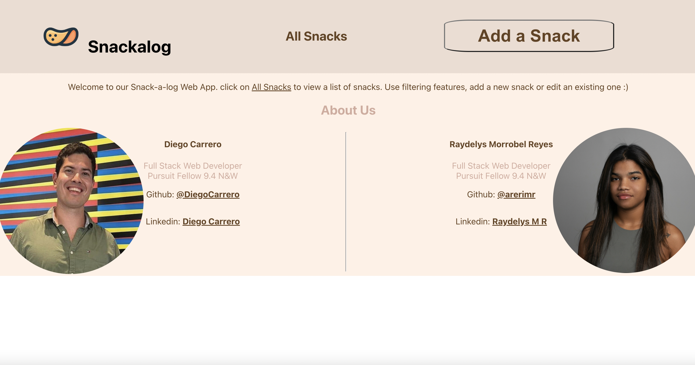
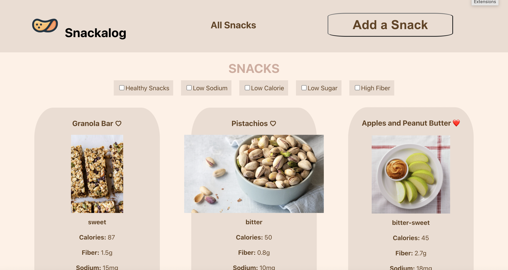
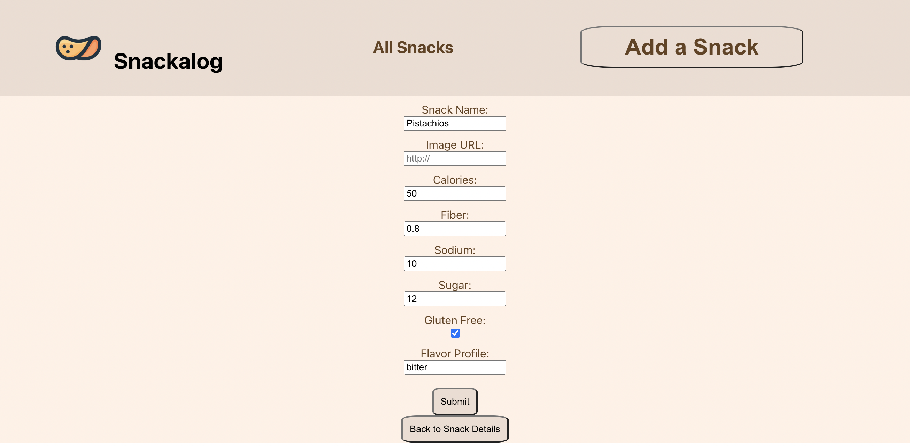

# [Snackalog](http://localhost:3000/)

## About
Full stack web application where user can view all snacks, or a single snack, update, create or delete a single snack. This application was created as part of the pursuit curriculum for educational purposes.

 

 

## Index Page
A list of snacks will be shown

* **Hover** over a snack
* **Click once** to view full snack details

 

 

#### [CLICK HERE](http://localhost:3000/) to view site!
Search and New Form

 

### Languages

⌨ JAVASCRIPT: EXPRESS.JS, REACT.JS

🍩SQL

💻 HTML

🎨 CSS